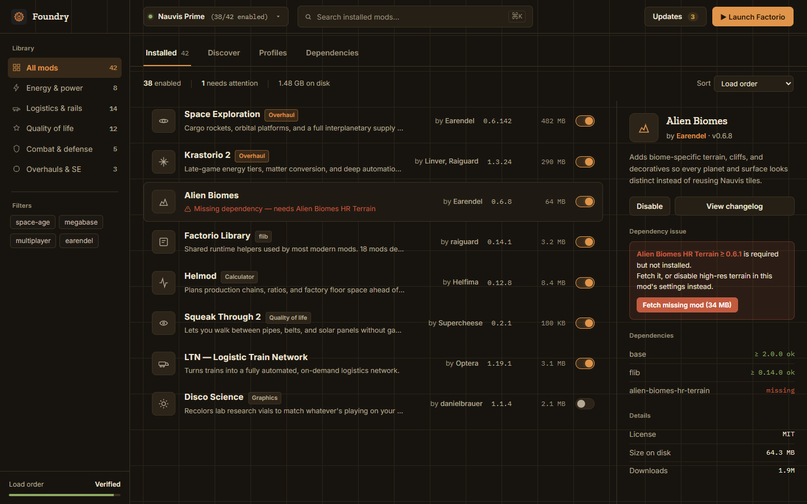
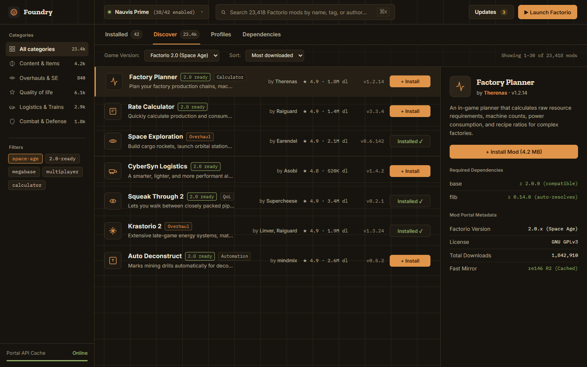

<p align="center">
  
</p>

<h1 align="center">Foundry</h1>

<p align="center">
  <b>A modern, high-performance Factorio Mod Manager built with Electron, React, and TypeScript.</b><br>
  <i>Inspired by r2modman — designed for instant browsing, isolated modpacks, and blazing-fast downloads.</i>
</p>

<p align="center">
  <a href="https://github.com/TheDragonSoft/foundry-mod-manager/releases"></a>
  <a href="https://factorio.com"></a>
  <a href="https://github.com/TheDragonSoft/foundry-mod-manager/releases"></a>
  <a href="LICENSE"></a>
</p>

<p align="center">
  <a href="#screenshots">Screenshots</a> •
  <a href="#downloads">Downloads</a> •
  <a href="#key-features">Key Features</a> •
  <a href="#how-to-run--build">Development</a> •
  <a href="#project-architecture">Architecture</a>
</p>

---

## Downloads

Get the latest release of Foundry for Windows:

| Package | Type | Download Link |
| :--- | :--- | :--- |
| **Windows Installer** | `.exe` (NSIS) | [⬇️ **Download Foundry Setup 1.0.0.exe**](https://github.com/TheDragonSoft/foundry-mod-manager/releases/download/v1.0.0/Foundry.Setup.1.0.0.exe) |
| **Portable Version** | `.exe` (Standalone) | [📦 **Download Foundry 1.0.0.exe**](https://github.com/TheDragonSoft/foundry-mod-manager/releases/download/v1.0.0/Foundry.1.0.0.exe) |

---

## Screenshots

### 🛠️ Installed Mods & Smart Dependency Resolution
Manage active mods with individual toggles, load-order verification, search, disk usage statistics, and real-time dependency issue resolution.



### 🌐 Official Mod Portal Catalog & 1-Click Install
Browse over 23,000 mods directly from the official portal with instant local search, Factorio 2.0 (Space Age) compatibility filtering, category tags, and high-speed mirror downloads.



---

## Key Features

- 🔄 **r2modman-Style Isolated Profiles:**
  - Create, clone, switch, and delete completely isolated mod profiles (e.g. *Space Age Vanilla+*, *Krastorio 2*, *Ultracube*, *Multiplayer Session*).
  - Each profile manages its own separate mod archives and independent `mod-list.json`.
  - **Shareable Profile Codes:** Export any profile into a compact shareable string. Teammates can paste the code to instantly download and activate the identical modpack and version set.

- ⚡ **High-Speed re146 R2 Mirror Downloader:**
  - Downloads mod zip archives directly from the Cloudflare R2 storage mirror (`https://mods-storage.re146.dev/`).
  - **No login tokens required** — mods download immediately without needing Factorio portal credentials.
  - Automatic retry, SHA1 checksum verification, and real-time progress tracking with transfer speeds.

- 🧩 **Deep Dependency Resolution:**
  - Full support for Factorio dependency rules (`base >= 2.0.0`, optional `?`, hidden `(?)`, incompatible `!`, and load order `~`).
  - When installing a mod, missing prerequisites are automatically resolved and installed in topological order.
  - Warns about missing requirements or mod conflicts before you launch.

- 🪐 **Factorio 2.0 & Space Age Ready:**
  - Native support for Factorio 2.0 expansion mods, new surface types, and legacy 1.1 backward-compatibility filtering.

- 🚀 **Flexible Game Launcher Integration:**
  - **Start Modded:** Launches Factorio with `--mod-directory "<Profile_Folder>"` so Factorio loads cleanly with the selected profile without touching your default game files.
  - **Start Vanilla:** Launches the unmodded base game cleanly in one click.
  - **Sync to Game Directory:** Copies the active profile's mods and `mod-list.json` directly into `%APPDATA%\Factorio\mods`, allowing you to launch from Steam while using your chosen profile.

---

## How to Run & Build

### Prerequisites
- [Node.js](https://nodejs.org/) (v18 or higher)
- npm or yarn

### Development Mode (Electron + Vite Hot Reload)
```bash
# Clone the repository
git clone https://github.com/TheDragonSoft/foundry-mod-manager.git
cd foundry-mod-manager

# Install dependencies
npm install

# Start in development mode with hot reloading
npm run dev
```

### Build Distribution Binaries
```bash
# Build production bundle and package Windows installer & portable binaries
npm run electron:dist
```

Output binaries will be placed in the `release/` directory:
- **Installer:** `release/Foundry Setup 1.0.0.exe`
- **Portable:** `release/Foundry 1.0.0.exe`
- **Unpacked Folder:** `release/win-unpacked/Foundry.exe`

---

## Project Architecture

```
foundry-mod-manager/
├── assets/
│   ├── logo.png                   # Minimalist application icon
│   ├── screenshot-installed.png   # In-app screenshot of Installed view
│   └── screenshot-discover.png    # In-app screenshot of Discover catalog
├── electron/
│   ├── main.ts                    # Electron main process & IPC handlers
│   ├── preload.ts                 # Context bridge & secure API exposure
│   └── services/
│       ├── dependencyService.ts   # Factorio dependency parser & resolver
│       ├── downloadService.ts     # re146 mirror streaming & downloader
│       ├── factorioService.ts     # Game path auto-detection & CLI launcher
│       ├── modPortalService.ts    # Mod portal API indexer & disk cache
│       └── profileService.ts      # Profile isolation & code sharing
├── src/
│   ├── components/
│   │   ├── ChangelogModal.tsx     # Mod changelog reader
│   │   ├── ConfirmModal.tsx       # Deletion & sync confirmations
│   │   ├── DownloadBar.tsx        # Floating real-time download bar
│   │   ├── InstalledView.tsx      # Installed mods list, toggles, updates
│   │   ├── OnlineView.tsx         # Mod portal catalog browser & filters
│   │   ├── ProfileModal.tsx       # Profile manager & code import/export
│   │   ├── SettingsModal.tsx      # Executable path, mirror URL, launcher settings
│   │   ├── Sidebar.tsx            # Navigation, categories, load-order status
│   │   └── Topbar.tsx             # Profile selector, search bar, launch buttons
│   ├── services/
│   │   └── api.ts                 # Electron IPC frontend client
│   ├── types/
│   │   └── index.ts               # Shared TypeScript interfaces
│   ├── App.tsx                    # Main layout orchestrator
│   └── index.css                  # Factorio industrial dark theme
├── electron-builder.yml           # Packaging configuration
├── package.json
└── README.md
```

---

## License

Distributed under the **MIT License**. See [`LICENSE`](LICENSE) for more details.
